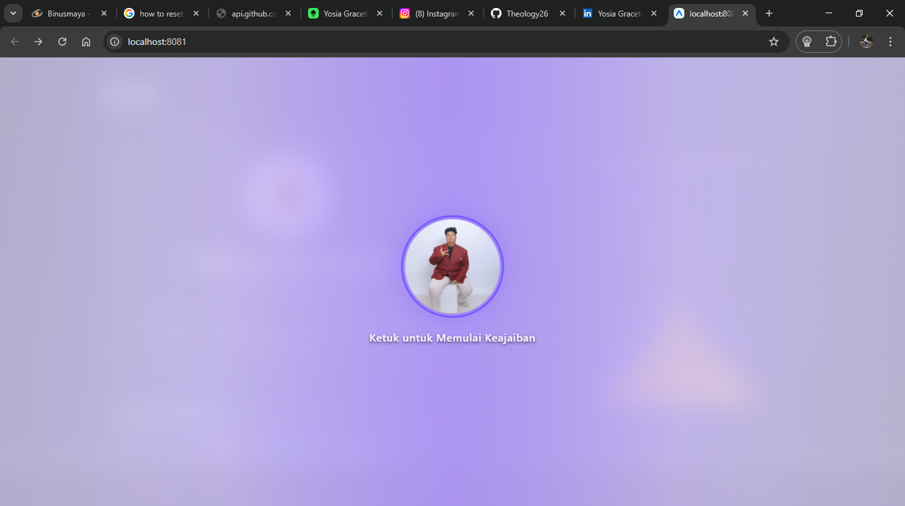

# Yosia Gracetheo Boimau - Interactive Portfolio

**Live Demo :** [https://webportofolioexpotheo.vercel.app/](https://webportofolioexpotheo.vercel.app/)

## Project Description
A highly interactive, responsive portfolio application built using React Native and Expo Web. This project aims to showcase personal background, educational timeline, and software engineering projects through a premium, high-fidelity user interface. The application features real-time data fetching via the GitHub API, an iOS Glassmorphism design system, and custom-built interactive canvas animations rendered natively.

## Core Features
- Theatrical Intro Overlay: A dynamic curtain-reveal transition that welcomes users before navigating to the main content.
- Real-time GitHub Integration: Automatically fetches and displays user profile data, repository lists, and programming language statistics using a GitHub Personal Access Token.
- Custom Interactive Animations:
  - Profile Tab: An interactive hourglass with dynamic sand physics.
  - Education Tab: Interactive Scales of Justice that react to screen touches.
  - Projects Tab: An Egyptian Pyramid landscape with a sandstorm effect and an interactive Bastet statue easter egg.
- Cross-Platform Compatibility: Engineered to run seamlessly on both desktop web browsers and native mobile environments via Expo Go.
- Responsive Layout: Dynamic positioning and scaling that adapts perfectly to both wide-screen monitors and narrow mobile devices.

## Architecture and Technology Stack
- Framework: React Native with Expo SDK
- Routing: Expo Router (File-based navigation system)
- Animations: React Native Animated API (for native component transitions) and HTML5 Canvas (for lightweight, 60fps dynamic rendering without heavy external libraries)
- Styling: React Native StyleSheet combined with expo-blur for complex iOS Glassmorphism aesthetics.
- External API: GitHub REST API

## System Requirements
Before running this project, ensure you have the following installed on your machine:
- Node.js (Version 18.x or newer)
- npm (Node Package Manager) or yarn
- Git
- Expo Go App (installed on your iOS or Android device for mobile testing)
- A GitHub Personal Access Token (PAT) for API authentication.

## Installation and Setup Guide

1. Clone the Repository
Open your terminal and clone the repository from GitHub:
```bash
git clone https://github.com/Theology26/webportofolioexpotheo.git
cd webportofolioexpotheo
```

2. Install Dependencies
Install all required Node modules:
```bash
npm install
```

3. Configure Environment (Optional for Evaluators)
The application connects to the GitHub API to fetch repository and profile data. 
- Out of the Box: It will work without any configuration using GitHub's public rate limits (60 requests/hour). This is usually sufficient for a quick evaluation.
- To prevent Rate Limiting: If you encounter an API limit, create a new file named `.env.local` in the root directory and add your own GitHub Personal Access Token:
```env
EXPO_PUBLIC_GITHUB_TOKEN=your_github_personal_access_token_here
```

4. Run the Development Server
Start the Expo development server:
```bash
npx expo start
```

## How to Run on Device

### Web Browser (PC/Laptop)
Once the server is running, press the `w` key in your terminal. Expo will automatically launch the web version of the portfolio in your default browser (usually at http://localhost:8081).

### Mobile Device (Expo Go)
1. Ensure your mobile device and computer are connected to the same Wi-Fi network.
2. Open the Expo Go application on your smartphone.
3. For Android: Scan the QR code displayed in your terminal using the Expo Go app.
   For iOS: Open your Camera app, scan the QR code, and tap the prompt to open in Expo Go.
4. The application will bundle and launch natively on your device.

## Visual Documentation (Screenshots)

### Web Interface
<div align="center">
  
  <br/><br/>
  
  
  <br/><br/>
  
  
  <br/><br/>
  
  
</div>

### Mobile Interface
<div align="center">
  
  
  
  <br/><br/>
  
  
  
</div>
